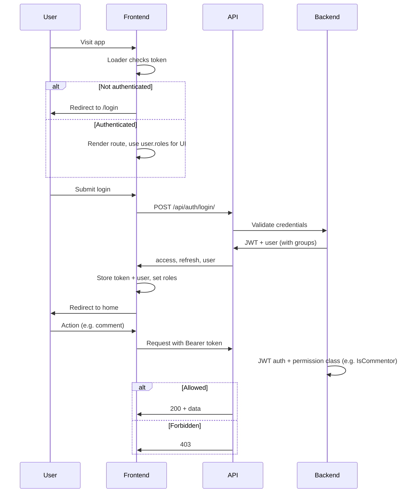

# Auth and Permissions: Frontend + Backend Plan

## Current state

- **Frontend ([building-management](building-management))**: React Router 7, Vite, Tailwind v4, single index route `routes/home.tsx`. No auth, no shadcn. Path alias: `~/*` → `./app/*`.
- **Backend ([inventory-backend/core/authentication](inventory-backend/core/authentication))**: JWT auth (login, register, profile, change-password, forgot-password). [permissions.py](inventory-backend/core/authentication/permissions.py) is empty. Uses Django’s default User (has `groups`, `is_staff`, `is_superuser`). Login returns `access`, `refresh`, `user` (no roles in token or user payload).

---

## Part 1: Frontend (building-management)

### 1.1 Install and configure shadcn

- Run `npx shadcn@latest init` in the project root. Use path alias `**@/*`** → `**./app/\*\*\*`(project uses`app/`not`src/`). Ensure Vite and Tailwind are detected (Tailwind v4 and `@tailwindcss/vite` already present in [package.json](building-management/package.json) and [app/app.css](building-management/app/app.css)).
- Add alias in [vite.config.ts](building-management/vite.config.ts) if the CLI does not: `"@": path.resolve(__dirname, "./app")`.
- Add components needed for auth forms: **input**, **button**, **label**, **card** (`npx shadcn@latest add input button label card`). These will live under `app/components/ui/`.

### 1.2 Input component and password “middleware”

- **Input**: Use shadcn’s Input as the canonical input. It will be at `app/components/ui/input.tsx`. No extra wrapper needed for plain text; use it directly where needed.
- **Password middleware (wrapper)**: Add a thin wrapper component whose only job is to import one concrete password UI and forward props. Purpose: all password fields use this wrapper so the actual component (name/path/implementation) can change in one place.
  - **Location**: e.g. `app/components/auth/PasswordInput.tsx` (or `app/components/form/PasswordInput.tsx`).
  - **API**: Accept the same props as the underlying input (e.g. `value`, `onChange`, `placeholder`, `disabled`, `className`, `id`, `name`, `aria-*`, etc.) and forward them to the real component.
  - **Implementation**: Import the shadcn Input (or a small `PasswordField` that uses Input with `type="password"`) from `~/components/ui/input` and render it with `type="password"`. Do not hardcode the UI component name/path in every form; only this file imports the concrete component.
  - **Naming**: e.g. `PasswordInput` so usage is `<PasswordInput {...props} />`. No need to call it “middleware” in the UI; “password input component” is enough.

### 1.3 Auth session and API client

- **Token + user storage**: Decide where to store access (and optionally refresh) token and user: e.g. in-memory + `localStorage` (or sessionStorage) so that reloads keep the user logged in. Same source will be used by loaders and UI.
- **Auth context**: Provide `user`, `isAuthenticated`, `login`, `logout`, and optionally `refreshToken` / loading state. On app init, restore from storage and optionally validate with backend (e.g. GET profile or token refresh).
- **API client**: Centralized fetch that attaches `Authorization: Bearer <access_token>` and uses base URL for the inventory backend. Handle 401 (e.g. try refresh or clear session and redirect to login).
- **Roles/permissions**: Store `user.groups` or `user.roles` (from login/profile response) in auth state. Expose helpers like `hasRole('admin')` or `hasPermission('comment')` so UI can conditionally render or disable actions.

### 1.4 Route structure and protected routes

- **Route config** in [app/routes.ts](building-management/app/routes.ts): Introduce a **layout** for protected app (all routes that require login) and keep auth routes outside it.
  - **Public (no auth required)**: `login`, `register`, `forgot-password`, `reset-password`. If the user is already authenticated, redirect to home (or dashboard).
  - **Protected**: Layout route whose **loader** checks auth (read token/user from the same storage the client uses; in SSR you may read cookie if you later move token to httpOnly cookie). If not authenticated, **redirect to `/login`** (and optionally save `redirectTo` in URL or session so you can send the user back after login).
  - **Children of protected layout**: e.g. index (home/dashboard), and future pages. Only these (and their loaders) run after the layout loader has confirmed auth.

Use a single source of truth for “is authenticated” in the loader (e.g. cookie or header sent from client). For React Router 7, the layout loader can return `{ user }` and throw `redirect('/login')` when there is no valid session.

### 1.5 Pages and forms

- **Login page** (`routes/login.tsx` or `routes/auth/login.tsx`): Form with username/email and password. Use shadcn **Input** for username, **PasswordInput** (middleware) for password, **Button**, **Label**, **Card**. On submit call auth API (e.g. `POST /api/auth/login/`), store tokens and user, then navigate to home or `redirectTo`.
- **Register page**: Same pattern with shadcn + **PasswordInput** for password and confirm password. Call `POST /api/auth/register/`.
- **Forgot-password page**: Email field, shadcn components. Call `POST /api/auth/forgot-password/`.
- **Reset-password page**: Read token from URL query, form with new password + confirm. Use **PasswordInput** for both. Call `POST /api/auth/reset-password/`.
- **Home/Dashboard**: Under protected layout; show welcome and optionally role-based content (e.g. “Admin” section only if `hasRole('admin')`).

### 1.6 Permission-aware UI

- Use `user.groups` / `user.roles` from auth state to:
  - **Show/hide** sections or links (e.g. admin nav, “Comment” button).
  - **Disable** actions for insufficient role (e.g. “Submit” for commentor-only area).
- Backend remains the authority; frontend only improves UX. Every sensitive action must be guarded by backend permissions.

---

## Part 2: Backend (inventory-backend/core/authentication)

### 2.1 Role model and JWT claims

- **Roles**: Use Django’s built-in **Group** model. Create groups (e.g. `admin`, `commentor`, `viewer`) via Django admin or migrations/data migration. Assign users to groups; no need for a custom User model for basic roles.
- **JWT custom claims**: Add to the access token (and optionally refresh) so the frontend can do permission-aware UI without calling profile on every load:
  - Include **group names** (e.g. `groups: ["admin", "commentor"]`) and/or **is_staff** in the token.
- **Implementation**: In [views.py](inventory-backend/core/authentication/views.py), when generating tokens in `LoginView`, use a custom token class or add claims after `RefreshToken.for_user(user)` (e.g. add `refresh['groups'] = list(user.groups.values_list('name', flat=True))`, and same for access). Alternatively, implement a custom serializer (e.g. extending Simple JWT’s token serializer) that adds these claims and use it in login. Prefer one place (e.g. a small `auth.utils` or `auth.serializers`) that both login and any token refresh use so claims stay consistent.

### 2.2 User serializer and login response

- In [serializers.py](inventory-backend/core/authentication/serializers.py), extend **UserSerializer** to include a **roles** or **groups** field (e.g. list of group names) so login and profile responses expose the same role info the frontend needs.
- Ensure login response in [views.py](inventory-backend/core/authentication/views.py) still returns `user` with this serializer so the frontend gets roles immediately after login.

### 2.3 Permission classes (SOLID and DRY)

- Implement [permissions.py](inventory-backend/core/authentication/permissions.py) with small, focused classes (SRP):
  - **IsAdmin**: Allow only if `user.is_staff` or user is in group named `admin` (or use Django’s `IsAdminUser` if you only care about `is_staff`).
  - **IsCommentor**: Allow if user is in group `commentor` (or has a specific permission). Implement as a base “role in group” permission and instantiate for `commentor`.
  - **IsAuthenticated**: Already provided by DRF; use where “any logged-in user” is enough.
- Prefer **composition**: e.g. `IsAuthenticated & (IsAdmin | IsCommentor)` for “admin or commentor only”. Keep each class checking one thing (OCP: new roles = new small class or param, not changing existing ones).
- Apply these permission classes on views that need them (e.g. certain inventory or future comment endpoints), not on login/register/forgot-password/reset-password (keep those **AllowAny**).

### 2.4 Optional: password reset token storage

- Backend already has **ForgotPasswordView** (sends email) and **ResetPasswordView** (currently returns 501). To complete reset flow: implement **PasswordResetToken** model (or use the commented sketch in [models.py](inventory-backend/core/authentication/models.py)), store token and expiry in **PasswordResetService**, and in **ResetPasswordView** validate token, find user, set password, invalidate token. Document in Swagger. This can be a follow-up if you want the first iteration to focus on login/register and permissions.

### 2.5 API docs and security

- Ensure **AllowAny** is explicit on login, register, forgot-password, reset-password. Document in **drf-spectacular** that these are public and that other endpoints require JWT and possibly role. Add a short note in schema that permission errors return 403 with a clear message.

---

## Data flow (high level)

---

## File and config summary

| Area     | Action                                                                                                                                                                                                       |
| -------- | ------------------------------------------------------------------------------------------------------------------------------------------------------------------------------------------------------------ |
| Frontend | Add `@` → `./app` in Vite + tsconfig if needed; run shadcn init and add input, button, label, card.                                                                                                          |
| Frontend | Add `app/components/auth/PasswordInput.tsx` (wrapper around shadcn Input type="password").                                                                                                                   |
| Frontend | Add auth context, API client with Bearer token, and role helpers.                                                                                                                                            |
| Frontend | Extend [app/routes.ts](building-management/app/routes.ts): public routes (login, register, forgot-password, reset-password), protected layout with auth loader redirecting to /login, children (home, etc.). |
| Frontend | Add login, register, forgot-password, reset-password pages using shadcn + PasswordInput; home under protected layout with optional role-based UI.                                                            |
| Backend  | Add JWT custom claims (groups, is_staff) in login (and optionally custom token serializer).                                                                                                                  |
| Backend  | Extend UserSerializer with groups/roles; use in login and profile.                                                                                                                                           |
| Backend  | Implement [permissions.py](inventory-backend/core/authentication/permissions.py): IsAdmin, IsCommentor (or generic “in group”), apply on relevant views.                                                     |
| Backend  | (Optional) Implement PasswordResetToken and ResetPasswordView logic; document.                                                                                                                               |

---

## Clarifications that may affect the plan

- **Redirect after login**: Always to a fixed path (e.g. `/`) or use a `redirectTo` query param from the login page?
- **Exact role names**: Besides `admin` and `commentor`, do you need more (e.g. `viewer`, `editor`) so we can add them in permissions and docs?
- **Where to enforce roles first**: Any specific backend endpoint (e.g. inventory create/update, or a future “comments” API) that must be restricted to admin or commentor in this iteration?
