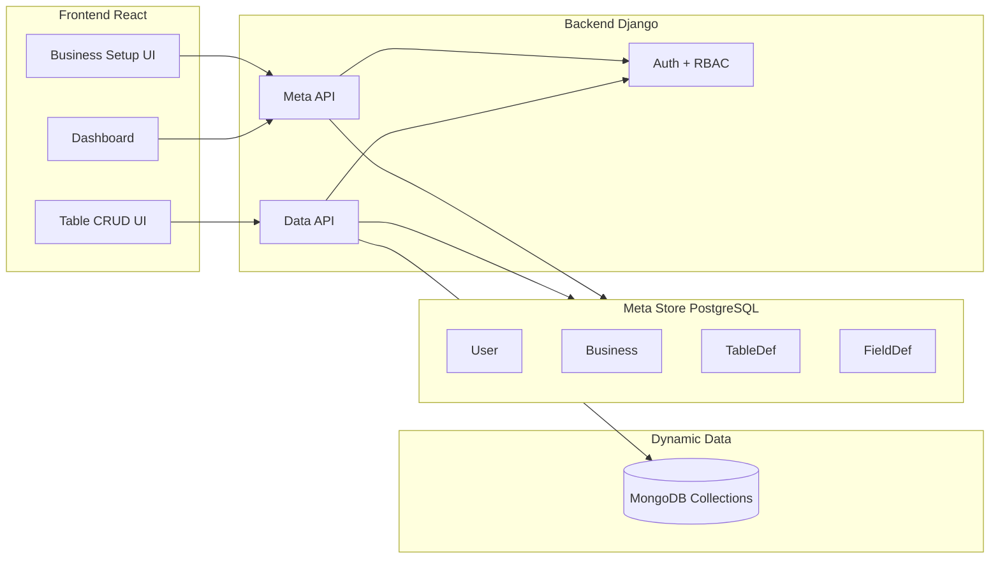

# Multi-Business Dynamic Schema — Architecture and Implementation Plan

## Current state (from codebase)

- **Frontend ([building-management](building-management))**: React Router (Vite), JWT auth, roles `visitor` / `manager` / `commentor` / `business-setup`. Protected home and a placeholder [business-setup](app/routes/business-setup.tsx) route.
- **Backend ([inventory-backend](inventory-backend))**: Django 4.2 + DRF, SQLite, JWT (simplejwt), auth with groups, [inventory](inventory-backend/core/inventory/models.py) app with fixed `Category` and `Item` models. No business or schema metadata yet.

---

## 1. Candid advice and risks

### Full UI-defined schema is high risk

Letting admins define arbitrary tables, fields, and relations via UI leads to:

- **Complexity**: Generic CRUD, validation, and permissions over “anything” are hard to get right; reporting and exports become generic and limited.
- **Performance**: Ad-hoc queries on dynamic collections (especially with relations) are difficult to index and tune; MongoDB helps flexibility but not automatic query efficiency.
- **Security**: You must validate and sanitize every dynamic field name and type; one mistake can open injection or privilege escalation.

**Recommendation:** Prefer a **constrained** first version: fixed base entities (e.g. Business, Table, Field, Relation) with a **bounded set of field types and relation kinds**, and optionally **predefined templates** (e.g. “Warehouse”, “Inventory”) that create a schema from a template instead of from scratch. Add full “draw your own schema” only after you have real demand and operational experience.

### MongoDB vs relational (PostgreSQL + EAV)

| Approach                     | Pros                                                                                                                                                    | Cons                                                                                                                                                  |
| ---------------------------- | ------------------------------------------------------------------------------------------------------------------------------------------------------- | ----------------------------------------------------------------------------------------------------------------------------------------------------- |
| **MongoDB for dynamic data** | Schema-less; one collection per business table; no migrations for new fields.                                                                           | Two stores (Django + Mongo); no JOINs; referential integrity and transactions across stores are manual; backup/restore and tooling differ.            |
| **PostgreSQL + EAV / JSONB** | Single DB; ACID; can use JSONB for flexible attributes and keep core meta in normal columns.                                                            | EAV is awkward for querying and reporting; JSONB is flexible but not “tables” in the UI sense; you still model “entity type” and “attributes” in SQL. |
| **Hybrid (recommended)**     | Django/PostgreSQL for **meta** (users, businesses, table/field/relation definitions, RBAC). MongoDB (or JSONB) only for **row data** of dynamic tables. | More moving parts; need clear boundaries (meta in Django, data in Mongo or JSONB).                                                                    |

**Recommendation:** Use a **hybrid**: keep Django + PostgreSQL (or SQLite for dev) for **identity, businesses, schema definitions, and permissions**. Store **dynamic table row data** either in MongoDB (one collection per business-scoped table) or in PostgreSQL as **one “rows” table per logical table** with a JSONB payload plus `business_id` and `table_id`. MongoDB is a good fit if you expect large, document-shaped payloads and want to avoid migrations entirely for row structure.

### RBAC on dynamic content

You already have role-based groups (`IsBusinessSetup`, etc.). For “view / edit / comment” per table or per business:

- **Option A — Role per table type:** e.g. “viewer”, “editor”, “commentor” as global roles; map to permissions per table (stored in meta).
- **Option B — Per-business assignment:** User–Business–Role (e.g. in a Django model); then permission = f(user, business, table, action). More flexible, more UI.

Start with **Option A** (roles you have + a simple permission matrix in meta); add per-business assignment when you need multi-tenant isolation.

---

## 2. Target architecture (high level)

- **Meta (Django + PostgreSQL):** User, Business, TableDefinition, FieldDefinition, RelationDefinition, and permission matrix (e.g. which role can view/edit which table).
- **Dynamic data:** One MongoDB collection per `(business_id, table_slug)`; documents are key-value per field definition, plus system fields (`_id`, `business_id`, `created_at`, etc.).
- **APIs:**
  - **Meta API:** CRUD for businesses, table/field/relation definitions (restricted to `business-setup` or equivalent).
  - **Data API:** List/Create/Update/Delete documents for a given business and table; enforce RBAC and validate payload against that table’s field definitions.

---

## 3. Security, performance, UI

- **Security:**
  - Validate table/field names with an allowlist (e.g. `^[a-z][a-z0-9_]*$`); never pass them raw into queries.
  - Use parameterized/ORM queries for meta; for MongoDB use the driver’s API (no string concatenation).
  - Enforce “user can access this business/table” before any data read/write; scope all data APIs by `business_id` and table id/slug.
- **Performance:**
  - Index MongoDB collections on `business_id` (if stored), and on fields used in filters/list.
  - Paginate all list endpoints; consider caps on collection size or row count per table for the first version.
- **UI (schema definition):**
  - Use a **form-based** “add table / add field / add relation” flow first (simpler and easier to secure).
  - Add drag-and-drop form builders (e.g. React Form Builder, Formio) only when you need custom forms; they don’t replace the need for a clear meta model (tables, fields, relations).

---

## 4. Phased implementation plan

### Phase 1 — Meta model and business setup (Django + DB)

- **1.1** Add Django models (in a new app, e.g. `business_meta`): `Business` (name, slug, created_at, etc.); `TableDefinition` (business FK, name, slug, ordering); `FieldDefinition` (table FK, name, slug, type enum: string, number, date, boolean, reference); `RelationDefinition` (from_table, to_table, from_field, to_field, kind: one-to-many, etc.). Use PostgreSQL (or keep SQLite for dev); no MongoDB yet.
- **1.2** Expose REST CRUD for Business and for Table/Field/Relation definitions, protected by `IsBusinessSetup`, with drf-spectacular docs. Validate slugs and names (allowlist).
- **1.3** (Optional) Add 1–2 **templates** (e.g. “Warehouse” with tables Inventory, Locations) that create Business + TableDefinitions + FieldDefinitions via a single API or management command.

**Deliverable:** Admins can create businesses and define tables/fields/relations via API (and later via UI).

### Phase 2 — Dynamic row storage (MongoDB or JSONB)

- **2.1** Add MongoDB (e.g. `pymongo`) and a small service layer: `get_collection(business_id, table_slug)` returning a MongoDB collection (naming: e.g. `b_{business_id}_{table_slug}`). Ensure collection names are derived from validated IDs/slugs only.
- **2.2** Implement **Data API**: `GET/POST /api/businesses/{id}/tables/{slug}/rows/`, `GET/PUT/PATCH/DELETE .../rows/{row_id}/`. Load TableDefinition + FieldDefinitions for the table; validate incoming JSON against field types; write to MongoDB. Enforce “user has access to this business/table” (e.g. via a simple permission model or role check).
- **2.3** Add list filtering (e.g. by one or two fields) and pagination; add indexes for `business_id` and commonly filtered fields.

**Deliverable:** Frontend can CRUD “rows” for any defined table; data lives in MongoDB.

### Phase 3 — Dashboard and table menu (frontend)

- **3.1** **Dashboard:** `GET /api/businesses/` (scoped by permission); show business cards on `/home` or `/dashboard`. Selecting a business navigates to `/businesses/:id` or `/dashboard/:businessId`.
- **3.2** **Table menu:** For a business, `GET /api/businesses/:id/tables/` (from TableDefinitions); show list of tables with links to “view” (list rows), “edit” (if role allows), “comment” (if you add comments later). Use existing `hasRole` and, when available, per-table permissions.
- **3.3** **Generic table view:** Page that loads table meta + rows (e.g. `GET /api/businesses/:id/tables/:slug/rows/`) and renders a data table (e.g. TanStack Table) with create/edit/delete actions based on RBAC.

**Deliverable:** Users see businesses, then tables, then rows; actions respect roles.

### Phase 4 — Schema builder UI (business-setup)

- **4.1** Business-setup page: List businesses; create/edit business (name, slug).
- **4.2** For a business: list tables; add/edit table (name, slug); for each table, list fields; add/edit field (name, slug, type); optional: add relation (from field, to table, kind). No raw “code” or free-form JSON—form-only.
- **4.3** Validation: duplicate slugs, invalid references, and circular relations; show errors in UI.

**Deliverable:** Admins define full schema from the UI without calling APIs manually.

### Phase 5 (later) — Relations in data API, reporting, templates

- Resolve “reference” fields in list/detail (e.g. load related row labels from target collection).
- Simple exports (CSV/Excel) per table.
- Predefined templates in the UI: “Create business from template: Warehouse”.

---

## 5. Example: FastAPI-style idea vs your stack

You mentioned FastAPI; your project is Django. Staying with Django is consistent and lets you reuse auth and DRF. If you ever split a “dynamic data” microservice, that could be FastAPI + PyMongo; for a single team and codebase, one Django app with a small MongoDB service layer is simpler. Example of how **dynamic collection** creation and a single endpoint could look in Django (conceptually):

- **Meta in Django:** Create/update `TableDefinition` and `FieldDefinition` via DRF; when a table is created, you do **not** create a MongoDB collection at that moment.
- **First write to a table:** In the Data API view, call something like `get_or_create_collection(business_id, table_slug)` (create collection if missing); insert document with validation from FieldDefinitions.
- **Validation:** Build a JSON schema or a simple validator from `FieldDefinition` (name → type); validate request body before insert/update.

No raw aggregation pipeline or `$where` from the client; keep query shapes controlled (e.g. filter by field X equals Y, plus pagination).

---

## 6. Summary and next steps

- **Do:** Hybrid meta (Django/PostgreSQL) + dynamic row data (MongoDB or PostgreSQL JSONB); bounded field types and relations; RBAC on tables; form-based schema UI first; pagination and indexing.
- **Avoid (for v1):** Fully free-form schema, client-defined queries, and drag-and-drop schema builder before you have a stable meta model and data API.
- **Next step:** Implement Phase 1 (meta models + REST) in [inventory-backend](inventory-backend); then add business list and table list to the frontend; then Phase 2 (MongoDB + Data API). After that, wire the business-setup UI (Phase 4) and refine RBAC (Phase 3/5).

If you tell me whether you prefer MongoDB vs PostgreSQL+JSONB for row data, I can outline the exact Django models and one sample Data API endpoint (with validation and collection naming) as the next concrete step.
