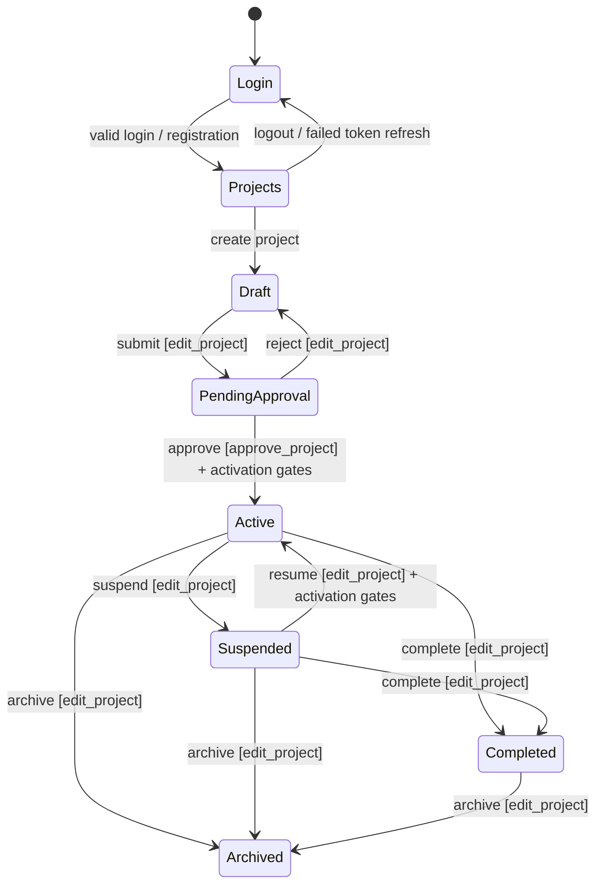

# Application Decision Tree & State Machine

Source baseline: **2026-10-09**, current working checkout, including uncommitted application changes. **550 decision directories** map **all 76 registered URL patterns** in `routes.ts` and `business-setup.routes.ts`. Each directory has a README describing trigger, inputs, authorization, API/state result, guards, source evidence and continuations.

Start at [Login](login/README.md), then [authenticated project list](login/submit-valid-credentials/README.md) or [project overview](login/submit-valid-credentials/select-project/README.md).

## How to read and extend the tree

- Each action/state owns a kebab-case directory. Special role or permission gates use `[brackets]`; public and standard authenticated actions do not. Local filters inherit their screen’s gate.
- Child folders describe forward decisions. Relative return/self links represent retry, Back, cancellation, shared navigation and state-machine cycles. Repeated records and field values are parameters rather than infinitely repeated directories.
- A screen lists its feature decisions; authenticated screens also link to the shared header/sidebar decisions. Detailed status prerequisites are described in the action README.
- API examples use the default `/api` base: auth is `/api/auth/...`, project domains are `/api/v1/...`. Named API helpers link to their implementation; environment overrides can change the host/base.
- Frontend visibility, project membership, effective permission codenames, procurement step roles and capability flags are separate checks. A visible link does not prove server authorization.
- Generic edit/filter nodes represent the fields/controls described in their inputs; validation outcomes stay on the form and return links lead to a corrected retry. This avoids claiming every possible input combination is a separate branch.

## Coverage and verification boundary

Registered-route coverage is complete for this source snapshot. Main navigation, wizard steps, CRUD/workflow actions, exports, offline recovery and permission failures are documented. This is **source verification**, not a completed browser walkthrough or a claim that every backend endpoint is exposed in the UI. Field-by-field validation permutations, device-specific gestures and every generic grid utility are not individually enumerated. Runtime behavior, external recovery delivery, file storage, task workers and legacy response compatibility still require their own checks.

[Machine-readable inventory](inventory.json) records routes and canonical nodes. Run the read-only validator from the repository root:

```bash
python3 docs/decision-tree/validate.py
```

It compares the inventory against registered routes, verifies source/link targets, directory naming, protected notation, required sections, parent-child links and reachability from Login. Adding a route without documenting it fails validation.

## Lifecycle and cross-cutting states



Daily reports use `draft/rejected → submitted → under_review → approved`; approval can also proceed directly from submitted. Rejection returns to `rejected`; requesting correction of a locked current report creates a new draft version. See the [report service](../../apps/api/core/field_reports/services/__init__.py) and [correction service](../../apps/api/core/field_reports/services/correction_service.py).

IPC submission follows `draft → submitted → approved → paid`. **IPC rejection returns to draft**, clearing submitted/approved snapshots for editing; it does not create a separate rejected status. See the [IPC service](../../apps/api/core/contracts/services/ipc_service.py).

Purchase requisition approval follows the stages below. Approve advances to the next stage; return/reject is available only where the [approval engine](../../apps/api/core/procurement/services/approval_engine.py) defines it. Workshop-scoped requisitions skip `workshop_approval`.

| Current requisition stage | Required role for that stage |
| --- | --- |
| `draft` | `block_engineer` for block scope; `workshop_supervisor` for workshop scope |
| `technical_review` | `technical_office` |
| `workshop_approval` (block scope only) | `workshop_supervisor` |
| `control_check` | `project_controller` |
| `pm_approval` | `project_manager` |
| `procurement_queue` | `procurement_officer` |
| `hq_control_approval` | `hq_project_controller` |
| `final_approval` | `ceo_or_pm_budget` (or either split role accepted by the permission class) |
| `approved` / `rejected` | Terminal approval outcome; follow the available inventory/commitment actions. |

| State / result | Available continuation |
| --- | --- |
| Missing session on protected route | Login with `redirectTo`, then retry the intended destination. |
| Request 401 | Refresh token once; if recovery fails, clear session and return to login. |
| Permission 403 / access denied | Return to allowed navigation; obtain the required membership/permission before retrying. |
| Invalid form / workflow status | Keep current form; correct required fields/status before retrying. |
| Empty data | Use a visible authorized create action or change filters; empty results alone do not grant write access. |
| Network/read failure | Use the component’s Retry where provided; resubmission of writes is subject to idempotency. |
| Offline daily-report save | Local IndexedDB/queue persistence; sync later, resolve conflicts or retry/discard failed queue items. |
| Queued import/simulation | Poll status; only completed result indicates success. |
| Archived project | Covered lifecycle/update operations are read-only for non-global-admin users. |
| Multi-request wizard failure | A project/IPC may already exist; later member/template/populate failure does not prove rollback. |

## Implementation differences to keep visible

| Area | Frontend behavior | Backend behavior |
| --- | --- | --- |
| Project approval | `approve_project OR edit_project` enables approval | Approval requires `approve_project`; activation gates also apply. |
| Project change-request decision | Frontend approver accepts `edit_project` too | Approve/reject requires `approve_project`. |
| Budget approval | `approve_costs OR edit_costs` enables controls | Approve/reject requires `approve_costs`. |
| New requisition link | List page checks `edit_reports` | Header creation requires `edit_procurement`. |
| IPC collection | Add receipt UI uses `edit_ipcs` | Collection write requires `edit_contracts`. |
| Correspondence tab | Read UI allows `view_documents` as fallback | Correspondence API requires `view_correspondence`. |
| Templates / org refs | Sidebar roles filter entry links | Their APIs use `IsAuthenticated`; no equivalent sidebar role restriction. |
| HR layout/job positions | Layout renders Outlet; hub cards filter by roles | Global job-positions screen is a placeholder, with no CRUD/API call. |
| Legacy route family | Registered pages still expect older business/assignment shapes | Blueprint project/membership responses can differ; compatibility is unverified. |

## Global tree map

Deeper form actions appear in the linked screen README; counts refer to real descendant directories.

```text
docs/decision-tree/
└── login/
    ├── submit-valid-credentials/
    │   ├── toggle-theme/
    │   ├── change-language/
    │   ├── logout/
    │   ├── open-mobile-navigation/
    │   ├── open-notifications/
    │   │   └── … 3 documented decisions (open README.md)
    │   ├── create-project/
    │   │   ├── step-1-fill-basic-info-and-next/
    │   │   │   ├── step-2-fill-dates-and-next/
    │   │   │   │   ├── search-and-add-team-member/
    │   │   │   │   ├── step-3-back-to-dates/
    │   │   │   │   └── create-draft-project/
    │   │   │   └── step-2-back-to-basic-info/
    │   │   ├── step-1-select-template/
    │   │   └── step-1-cancel-to-project-list/
    │   ├── select-project/
    │   │   ├── [submit-project]/
    │   │   ├── [approve-project]/
    │   │   ├── [reject-project]/
    │   │   ├── [suspend-project]/
    │   │   ├── [resume-project]/
    │   │   ├── [complete-project]/
    │   │   ├── [archive-project]/
    │   │   ├── [save-kickoff-charter]/
    │   │   ├── [navigate-wbs]/
    │   │   │   └── … 11 documented decisions (open README.md)
    │   │   ├── [navigate-activities]/
    │   │   │   └── … 13 documented decisions (open README.md)
    │   │   ├── [navigate-gantt]/
    │   │   │   └── … 9 documented decisions (open README.md)
    │   │   ├── [navigate-schedule-status]/
    │   │   │   └── … 6 documented decisions (open README.md)
    │   │   ├── [navigate-progress]/
    │   │   │   └── … 8 documented decisions (open README.md)
    │   │   ├── [navigate-activity-log]/
    │   │   │   └── … 1 documented decisions (open README.md)
    │   │   ├── [navigate-daily-reports]/
    │   │   │   └── … 95 documented decisions (open README.md)
    │   │   ├── navigate-sync-conflicts/
    │   │   │   └── … 6 documented decisions (open README.md)
    │   │   ├── [navigate-weather]/
    │   │   │   └── … 4 documented decisions (open README.md)
    │   │   ├── [navigate-barriers]/
    │   │   │   └── … 4 documented decisions (open README.md)
    │   │   ├── [navigate-risk-register]/
    │   │   │   └── … 3 documented decisions (open README.md)
    │   │   ├── [navigate-alerts]/
    │   │   │   └── … 7 documented decisions (open README.md)
    │   │   ├── [navigate-contracts]/
    │   │   │   ├── filter-and-change-view/
    │   │   │   ├── [create-contract]/
    │   │   │   │   └── … 2 documented decisions (open README.md)
    │   │   │   ├── [open-contract]/
    │   │   │   │   └── … 7 documented decisions (open README.md)
    │   │   │   ├── [open-ipc]/
    │   │   │   │   └── … 10 documented decisions (open README.md)
    │   │   │   └── retry-failed-load/
    │   │   ├── [navigate-subcontractors]/
    │   │   │   ├── filter-and-change-view/
    │   │   │   ├── [open-subcontractor]/
    │   │   │   │   └── … 6 documented decisions (open README.md)
    │   │   │   ├── [create-subcontractor]/
    │   │   │   └── retry-failed-load/
    │   │   ├── [navigate-documents]/
    │   │   │   └── … 7 documented decisions (open README.md)
    │   │   ├── [navigate-cash-flow]/
    │   │   │   └── … 6 documented decisions (open README.md)
    │   │   ├── [navigate-costs]/
    │   │   │   └── … 29 documented decisions (open README.md)
    │   │   ├── [navigate-material-balance]/
    │   │   │   └── … 5 documented decisions (open README.md)
    │   │   ├── [navigate-procurement]/
    │   │   │   ├── filter-and-change-view/
    │   │   │   ├── [create-requisition]/
    │   │   │   │   └── … 4 documented decisions (open README.md)
    │   │   │   ├── [open-requisition]/
    │   │   │   │   └── … 9 documented decisions (open README.md)
    │   │   │   ├── [open-officer-dashboard]/
    │   │   │   │   └── … 3 documented decisions (open README.md)
    │   │   │   ├── [open-block-inventory]/
    │   │   │   │   └── … 5 documented decisions (open README.md)
    │   │   │   ├── [open-procurement-reports]/
    │   │   │   │   └── … 2 documented decisions (open README.md)
    │   │   │   ├── [manage-blocks]/
    │   │   │   │   └── … 5 documented decisions (open README.md)
    │   │   │   ├── [open-stock-transfers]/
    │   │   │   │   └── … 5 documented decisions (open README.md)
    │   │   │   ├── retry-failed-load/
    │   │   │   └── start-product-tour/
    │   │   ├── [navigate-economic]/
    │   │   │   └── … 4 documented decisions (open README.md)
    │   │   ├── [navigate-equipment-utilization]/
    │   │   │   └── … 2 documented decisions (open README.md)
    │   │   ├── [navigate-equipment-log]/
    │   │   │   └── … 3 documented decisions (open README.md)
    │   │   ├── [navigate-labor-productivity]/
    │   │   │   └── … 1 documented decisions (open README.md)
    │   │   ├── [navigate-personnel-summary]/
    │   │   │   └── … 2 documented decisions (open README.md)
    │   │   ├── [navigate-manpower]/
    │   │   │   └── … 3 documented decisions (open README.md)
    │   │   ├── [navigate-labor-camp]/
    │   │   │   └── … 3 documented decisions (open README.md)
    │   │   ├── [navigate-overtime-requests]/
    │   │   │   └── … 8 documented decisions (open README.md)
    │   │   ├── [navigate-leave-requests]/
    │   │   │   └── … 10 documented decisions (open README.md)
    │   │   ├── [navigate-resource-allocations]/
    │   │   │   └── … 13 documented decisions (open README.md)
    │   │   ├── navigate-project-settings/
    │   │   │   └── … 9 documented decisions (open README.md)
    │   │   ├── [navigate-project-members]/
    │   │   │   └── … 4 documented decisions (open README.md)
    │   │   ├── [navigate-stakeholders]/
    │   │   │   └── … 1 documented decisions (open README.md)
    │   │   ├── [navigate-sub-reports]/
    │   │   │   └── … 3 documented decisions (open README.md)
    │   │   ├── [navigate-concrete-operations]/
    │   │   │   └── … 6 documented decisions (open README.md)
    │   │   └── retry-failed-load/
    │   ├── [navigate-hr-hub]/
    │   │   ├── [navigate-hr-users]/
    │   │   │   └── … 5 documented decisions (open README.md)
    │   │   ├── [navigate-hr-job-positions]/
    │   │   │   └── … 1 documented decisions (open README.md)
    │   │   └── [navigate-business-setup]/
    │   │       └── … 2 documented decisions (open README.md)
    │   ├── [navigate-templates]/
    │   │   └── … 2 documented decisions (open README.md)
    │   ├── [navigate-roles]/
    │   │   └── … 4 documented decisions (open README.md)
    │   ├── [navigate-org-refs]/
    │   │   └── … 2 documented decisions (open README.md)
    │   ├── [open-legacy-project]/
    │   │   ├── [navigate-schema-setup]/
    │   │   │   └── … 6 documented decisions (open README.md)
    │   │   ├── [open-dynamic-table]/
    │   │   │   └── … 5 documented decisions (open README.md)
    │   │   ├── [open-legacy-members]/
    │   │   │   └── … 2 documented decisions (open README.md)
    │   │   ├── [open-project-positions]/
    │   │   │   └── … 4 documented decisions (open README.md)
    │   │   ├── [open-buildings-department]/
    │   │   │   └── … 6 documented decisions (open README.md)
    │   │   ├── [open-mechanical-department]/
    │   │   │   └── … 6 documented decisions (open README.md)
    │   │   ├── [open-security-department]/
    │   │   │   └── … 6 documented decisions (open README.md)
    │   │   ├── [open-machinery-department]/
    │   │   │   └── … 6 documented decisions (open README.md)
    │   │   ├── [open-warehouse-department]/
    │   │   │   └── … 6 documented decisions (open README.md)
    │   │   └── [open-electrical-department]/
    │   │       └── … 6 documented decisions (open README.md)
    │   ├── open-portfolio-liquidity/
    │   │   └── … 7 documented decisions (open README.md)
    │   ├── retry-failed-load/
    │   └── recover-expired-session/
    ├── submit-invalid-credentials/
    │   └── … 4 documented decisions (open README.md)
    ├── navigate-register/
    │   ├── submit-valid-registration/
    │   ├── submit-invalid-registration/
    │   ├── navigate-back-to-login/
    │   ├── toggle-theme/
    │   ├── change-language/
    │   └── toggle-password-visibility/
    ├── navigate-forgot-password/
    │   ├── submit-phone-for-reset/
    │   │   └── open-reset-link/
    │   │       └── … 6 documented decisions (open README.md)
    │   ├── navigate-back-to-login/
    │   ├── toggle-theme/
    │   └── change-language/
    ├── toggle-theme/
    ├── change-language/
    └── toggle-password-visibility/
```

## Registered routes

| URL pattern | Route component source | Canonical decision | Scope |
| --- | --- | --- | --- |
| `/` | [index.tsx](../../apps/web/src/app/routes/index.tsx) | [Open the application](login/README.md) | Current |
| `/forgot-password` | [forgot-password.tsx](../../apps/web/src/app/routes/forgot-password.tsx) | [Request password recovery](login/navigate-forgot-password/README.md) | Current |
| `/home` | [home.tsx](../../apps/web/src/app/routes/home.tsx) | [Submit valid credentials](login/submit-valid-credentials/README.md) | Current |
| `/hr` | [home.tsx](../../apps/web/src/app/routes/hr/home.tsx) | [Open HR hub](login/submit-valid-credentials/%5Bnavigate-hr-hub%5D/README.md) | Current |
| `/hr/job-positions` | [job-positions.tsx](../../apps/web/src/app/routes/hr/job-positions.tsx) | [HR job positions](login/submit-valid-credentials/%5Bnavigate-hr-hub%5D/%5Bnavigate-hr-job-positions%5D/README.md) | Placeholder |
| `/hr/users` | [users.tsx](../../apps/web/src/app/routes/hr/users.tsx) | [HR users](login/submit-valid-credentials/%5Bnavigate-hr-hub%5D/%5Bnavigate-hr-users%5D/README.md) | Current |
| `/login` | [login.tsx](../../apps/web/src/app/routes/login.tsx) | [Open the application](login/README.md) | Current |
| `/portfolio/liquidity` | [portfolio-liquidity.tsx](../../apps/web/src/app/routes/portfolio-liquidity.tsx) | [Portfolio liquidity allocation](login/submit-valid-credentials/open-portfolio-liquidity/README.md) | Current |
| `/projects` | [project-list.tsx](../../apps/web/src/app/routes/project-list.tsx) | [Submit valid credentials](login/submit-valid-credentials/README.md) | Current |
| `/projects/:businessId` | [business.tsx](../../apps/web/src/app/routes/business.tsx) | [Open legacy project area](login/submit-valid-credentials/%5Bopen-legacy-project%5D/README.md) | Legacy |
| `/projects/:businessId/buildings` | [business-buildings.tsx](../../apps/web/src/app/routes/business-buildings.tsx) | [Buildings department activity](login/submit-valid-credentials/%5Bopen-legacy-project%5D/%5Bopen-buildings-department%5D/README.md) | Legacy |
| `/projects/:businessId/electrical` | [business-electrical.tsx](../../apps/web/src/app/routes/business-electrical.tsx) | [Electrical department activity](login/submit-valid-credentials/%5Bopen-legacy-project%5D/%5Bopen-electrical-department%5D/README.md) | Legacy |
| `/projects/:businessId/job-positions` | [business-job-positions.tsx](../../apps/web/src/app/routes/business-job-positions.tsx) | [Project job positions](login/submit-valid-credentials/%5Bopen-legacy-project%5D/%5Bopen-project-positions%5D/README.md) | Legacy |
| `/projects/:businessId/machinery` | [business-machinery.tsx](../../apps/web/src/app/routes/business-machinery.tsx) | [Machinery department activity](login/submit-valid-credentials/%5Bopen-legacy-project%5D/%5Bopen-machinery-department%5D/README.md) | Legacy |
| `/projects/:businessId/mechanical` | [business-mechanical.tsx](../../apps/web/src/app/routes/business-mechanical.tsx) | [Mechanical department activity](login/submit-valid-credentials/%5Bopen-legacy-project%5D/%5Bopen-mechanical-department%5D/README.md) | Legacy |
| `/projects/:businessId/security` | [business-security.tsx](../../apps/web/src/app/routes/business-security.tsx) | [Security department activity](login/submit-valid-credentials/%5Bopen-legacy-project%5D/%5Bopen-security-department%5D/README.md) | Legacy |
| `/projects/:businessId/setup` | [business-setup-schema.tsx](../../apps/web/src/app/routes/business-setup-schema.tsx) | [Legacy table/field schema setup](login/submit-valid-credentials/%5Bopen-legacy-project%5D/%5Bnavigate-schema-setup%5D/README.md) | Legacy |
| `/projects/:businessId/tables/:tableSlug` | [business-table.tsx](../../apps/web/src/app/routes/business-table.tsx) | [Open dynamic table](login/submit-valid-credentials/%5Bopen-legacy-project%5D/%5Bopen-dynamic-table%5D/README.md) | Legacy |
| `/projects/:businessId/users` | [business-users.tsx](../../apps/web/src/app/routes/business-users.tsx) | [Legacy project members](login/submit-valid-credentials/%5Bopen-legacy-project%5D/%5Bopen-legacy-members%5D/README.md) | Legacy |
| `/projects/:businessId/warehouse` | [business-warehouse.tsx](../../apps/web/src/app/routes/business-warehouse.tsx) | [Warehouse department activity](login/submit-valid-credentials/%5Bopen-legacy-project%5D/%5Bopen-warehouse-department%5D/README.md) | Legacy |
| `/projects/:projectId/activities` | [project-activities.tsx](../../apps/web/src/app/routes/project-activities.tsx) | [Activities](login/submit-valid-credentials/select-project/%5Bnavigate-activities%5D/README.md) | Current |
| `/projects/:projectId/activity-log` | [project-activity-log.tsx](../../apps/web/src/app/routes/project-activity-log.tsx) | [Activity bank](login/submit-valid-credentials/select-project/%5Bnavigate-activity-log%5D/README.md) | Current |
| `/projects/:projectId/alerts` | [project-alerts.tsx](../../apps/web/src/app/routes/project-alerts.tsx) | [Alerts](login/submit-valid-credentials/select-project/%5Bnavigate-alerts%5D/README.md) | Current |
| `/projects/:projectId/barriers` | [project-barriers.tsx](../../apps/web/src/app/routes/project-barriers.tsx) | [Barriers](login/submit-valid-credentials/select-project/%5Bnavigate-barriers%5D/README.md) | Current |
| `/projects/:projectId/cash-flow` | [project-cash-flow.tsx](../../apps/web/src/app/routes/project-cash-flow.tsx) | [Cash flow](login/submit-valid-credentials/select-project/%5Bnavigate-cash-flow%5D/README.md) | Current |
| `/projects/:projectId/concrete-operations` | [project-concrete-operations.tsx](../../apps/web/src/app/routes/project-concrete-operations.tsx) | [Concrete operations](login/submit-valid-credentials/select-project/%5Bnavigate-concrete-operations%5D/README.md) | Current |
| `/projects/:projectId/contracts` | [project-contracts.tsx](../../apps/web/src/app/routes/project-contracts.tsx) | [Contracts](login/submit-valid-credentials/select-project/%5Bnavigate-contracts%5D/README.md) | Current |
| `/projects/:projectId/contracts/:contractId` | [project-contract-detail.tsx](../../apps/web/src/app/routes/project-contract-detail.tsx) | [Open contract](login/submit-valid-credentials/select-project/%5Bnavigate-contracts%5D/%5Bopen-contract%5D/README.md) | Current |
| `/projects/:projectId/contracts/new` | [project-contract-form.tsx](../../apps/web/src/app/routes/project-contract-form.tsx) | [Create contract](login/submit-valid-credentials/select-project/%5Bnavigate-contracts%5D/%5Bcreate-contract%5D/README.md) | Current |
| `/projects/:projectId/costs` | [project-costs.tsx](../../apps/web/src/app/routes/project-costs.tsx) | [Cost control](login/submit-valid-credentials/select-project/%5Bnavigate-costs%5D/README.md) | Current |
| `/projects/:projectId/daily-reports` | [daily-reports-list.tsx](../../apps/web/src/app/routes/daily-reports-list.tsx) | [Daily reports](login/submit-valid-credentials/select-project/%5Bnavigate-daily-reports%5D/README.md) | Current |
| `/projects/:projectId/daily-reports/:reportId/edit` | [daily-report-form-edit.tsx](../../apps/web/src/app/routes/daily-report-form-edit.tsx) | [Edit daily report](login/submit-valid-credentials/select-project/%5Bnavigate-daily-reports%5D/%5Bedit-report%5D/README.md) | Current |
| `/projects/:projectId/daily-reports/:reportId/view` | [daily-report-view.tsx](../../apps/web/src/app/routes/daily-report-view.tsx) | [View daily report](login/submit-valid-credentials/select-project/%5Bnavigate-daily-reports%5D/%5Bview-report%5D/README.md) | Current |
| `/projects/:projectId/daily-reports/new` | [daily-report-form.tsx](../../apps/web/src/app/routes/daily-report-form.tsx) | [Create daily report](login/submit-valid-credentials/select-project/%5Bnavigate-daily-reports%5D/%5Bcreate-report%5D/README.md) | Current |
| `/projects/:projectId/documents` | [project-documents.tsx](../../apps/web/src/app/routes/project-documents.tsx) | [Documents and correspondence](login/submit-valid-credentials/select-project/%5Bnavigate-documents%5D/README.md) | Current |
| `/projects/:projectId/economic` | [project-economic.tsx](../../apps/web/src/app/routes/project-economic.tsx) | [Economic analysis](login/submit-valid-credentials/select-project/%5Bnavigate-economic%5D/README.md) | Current |
| `/projects/:projectId/equipment-log` | [project-equipment-log.tsx](../../apps/web/src/app/routes/project-equipment-log.tsx) | [Equipment logs](login/submit-valid-credentials/select-project/%5Bnavigate-equipment-log%5D/README.md) | Current |
| `/projects/:projectId/equipment-utilization` | [project-equipment-utilization.tsx](../../apps/web/src/app/routes/project-equipment-utilization.tsx) | [Equipment utilization](login/submit-valid-credentials/select-project/%5Bnavigate-equipment-utilization%5D/README.md) | Current |
| `/projects/:projectId/ipcs/:ipcId` | [project-ipc-detail.tsx](../../apps/web/src/app/routes/project-ipc-detail.tsx) | [Open IPC](login/submit-valid-credentials/select-project/%5Bnavigate-contracts%5D/%5Bopen-ipc%5D/README.md) | Current |
| `/projects/:projectId/labor-camp` | [project-labor-camp.tsx](../../apps/web/src/app/routes/project-labor-camp.tsx) | [Labor camp](login/submit-valid-credentials/select-project/%5Bnavigate-labor-camp%5D/README.md) | Current |
| `/projects/:projectId/labor-productivity` | [project-labor-productivity.tsx](../../apps/web/src/app/routes/project-labor-productivity.tsx) | [Labor productivity](login/submit-valid-credentials/select-project/%5Bnavigate-labor-productivity%5D/README.md) | Current |
| `/projects/:projectId/leave-requests` | [project-leave-requests.tsx](../../apps/web/src/app/routes/project-leave-requests.tsx) | [Leave requests](login/submit-valid-credentials/select-project/%5Bnavigate-leave-requests%5D/README.md) | Current |
| `/projects/:projectId/manpower` | [project-manpower.tsx](../../apps/web/src/app/routes/project-manpower.tsx) | [Manpower](login/submit-valid-credentials/select-project/%5Bnavigate-manpower%5D/README.md) | Current |
| `/projects/:projectId/material-balance` | [project-material-balance.tsx](../../apps/web/src/app/routes/project-material-balance.tsx) | [Material balance](login/submit-valid-credentials/select-project/%5Bnavigate-material-balance%5D/README.md) | Current |
| `/projects/:projectId/overtime-requests` | [project-overtime-requests.tsx](../../apps/web/src/app/routes/project-overtime-requests.tsx) | [Overtime requests](login/submit-valid-credentials/select-project/%5Bnavigate-overtime-requests%5D/README.md) | Current |
| `/projects/:projectId/overview` | [project-overview.tsx](../../apps/web/src/app/routes/project-overview.tsx) | [Select a project](login/submit-valid-credentials/select-project/README.md) | Current |
| `/projects/:projectId/personnel-summary` | [project-personnel-summary.tsx](../../apps/web/src/app/routes/project-personnel-summary.tsx) | [Personnel summary](login/submit-valid-credentials/select-project/%5Bnavigate-personnel-summary%5D/README.md) | Current |
| `/projects/:projectId/procurement` | [procurement-list.tsx](../../apps/web/src/app/routes/procurement/procurement-list.tsx) | [Procurement](login/submit-valid-credentials/select-project/%5Bnavigate-procurement%5D/README.md) | Current |
| `/projects/:projectId/procurement/blocks` | [procurement-blocks.tsx](../../apps/web/src/app/routes/procurement/procurement-blocks.tsx) | [Procurement blocks](login/submit-valid-credentials/select-project/%5Bnavigate-procurement%5D/%5Bmanage-blocks%5D/README.md) | Current |
| `/projects/:projectId/procurement/inventory` | [procurement-inventory.tsx](../../apps/web/src/app/routes/procurement/procurement-inventory.tsx) | [Block inventory](login/submit-valid-credentials/select-project/%5Bnavigate-procurement%5D/%5Bopen-block-inventory%5D/README.md) | Current |
| `/projects/:projectId/procurement/new` | [procurement-new.tsx](../../apps/web/src/app/routes/procurement/procurement-new.tsx) | [Create purchase requisition](login/submit-valid-credentials/select-project/%5Bnavigate-procurement%5D/%5Bcreate-requisition%5D/README.md) | Current |
| `/projects/:projectId/procurement/officer` | [procurement-officer.tsx](../../apps/web/src/app/routes/procurement/procurement-officer.tsx) | [Procurement officer dashboard](login/submit-valid-credentials/select-project/%5Bnavigate-procurement%5D/%5Bopen-officer-dashboard%5D/README.md) | Current |
| `/projects/:projectId/procurement/reports` | [procurement-reports.tsx](../../apps/web/src/app/routes/procurement/procurement-reports.tsx) | [Procurement reports](login/submit-valid-credentials/select-project/%5Bnavigate-procurement%5D/%5Bopen-procurement-reports%5D/README.md) | Current |
| `/projects/:projectId/procurement/req/:reqId` | [procurement-detail.tsx](../../apps/web/src/app/routes/procurement/procurement-detail.tsx) | [Open requisition](login/submit-valid-credentials/select-project/%5Bnavigate-procurement%5D/%5Bopen-requisition%5D/README.md) | Current |
| `/projects/:projectId/procurement/transfers` | [procurement-transfers.tsx](../../apps/web/src/app/routes/procurement/procurement-transfers.tsx) | [Internal stock transfers](login/submit-valid-credentials/select-project/%5Bnavigate-procurement%5D/%5Bopen-stock-transfers%5D/README.md) | Current |
| `/projects/:projectId/progress` | [project-progress.tsx](../../apps/web/src/app/routes/project-progress.tsx) | [Progress dashboard](login/submit-valid-credentials/select-project/%5Bnavigate-progress%5D/README.md) | Current |
| `/projects/:projectId/resource-allocations` | [project-resource-allocations.tsx](../../apps/web/src/app/routes/project-resource-allocations.tsx) | [Resource allocations](login/submit-valid-credentials/select-project/%5Bnavigate-resource-allocations%5D/README.md) | Current |
| `/projects/:projectId/risk-register` | [project-risk-register.tsx](../../apps/web/src/app/routes/project-risk-register.tsx) | [Risk and delay register](login/submit-valid-credentials/select-project/%5Bnavigate-risk-register%5D/README.md) | Current |
| `/projects/:projectId/schedule/gantt` | [project-schedule-gantt.tsx](../../apps/web/src/app/routes/project-schedule-gantt.tsx) | [Schedule Gantt](login/submit-valid-credentials/select-project/%5Bnavigate-gantt%5D/README.md) | Current |
| `/projects/:projectId/schedule/status` | [project-schedule-status.tsx](../../apps/web/src/app/routes/project-schedule-status.tsx) | [Schedule status](login/submit-valid-credentials/select-project/%5Bnavigate-schedule-status%5D/README.md) | Current |
| `/projects/:projectId/settings` | [project-settings.tsx](../../apps/web/src/app/routes/project-settings.tsx) | [Project settings](login/submit-valid-credentials/select-project/navigate-project-settings/README.md) | Current |
| `/projects/:projectId/settings/members` | [project-members.tsx](../../apps/web/src/app/routes/project-members.tsx) | [Project members](login/submit-valid-credentials/select-project/%5Bnavigate-project-members%5D/README.md) | Current |
| `/projects/:projectId/stakeholders` | [project-stakeholders.tsx](../../apps/web/src/app/routes/project-stakeholders.tsx) | [Stakeholders](login/submit-valid-credentials/select-project/%5Bnavigate-stakeholders%5D/README.md) | Current |
| `/projects/:projectId/sub-reports` | [project-sub-reports.tsx](../../apps/web/src/app/routes/project-sub-reports.tsx) | [Discipline subreports](login/submit-valid-credentials/select-project/%5Bnavigate-sub-reports%5D/README.md) | Current |
| `/projects/:projectId/subcontractors` | [project-subcontractors.tsx](../../apps/web/src/app/routes/project-subcontractors.tsx) | [Subcontractors](login/submit-valid-credentials/select-project/%5Bnavigate-subcontractors%5D/README.md) | Current |
| `/projects/:projectId/subcontractors/:subId` | [project-subcontractor-detail.tsx](../../apps/web/src/app/routes/project-subcontractor-detail.tsx) | [Open subcontractor](login/submit-valid-credentials/select-project/%5Bnavigate-subcontractors%5D/%5Bopen-subcontractor%5D/README.md) | Current |
| `/projects/:projectId/sync-conflicts` | [sync-conflicts.tsx](../../apps/web/src/app/routes/sync-conflicts.tsx) | [Sync conflicts](login/submit-valid-credentials/select-project/navigate-sync-conflicts/README.md) | Current |
| `/projects/:projectId/wbs` | [project-wbs.tsx](../../apps/web/src/app/routes/project-wbs.tsx) | [WBS](login/submit-valid-credentials/select-project/%5Bnavigate-wbs%5D/README.md) | Current |
| `/projects/:projectId/weather` | [project-weather.tsx](../../apps/web/src/app/routes/project-weather.tsx) | [Weather logs](login/submit-valid-credentials/select-project/%5Bnavigate-weather%5D/README.md) | Current |
| `/projects/new` | [project-create-wizard.tsx](../../apps/web/src/app/routes/project-create-wizard.tsx) | [Create a project](login/submit-valid-credentials/create-project/README.md) | Current |
| `/projects/setup` | [business-setup.tsx](../../apps/web/src/app/routes/business-setup.tsx) | [Legacy project setup list](login/submit-valid-credentials/%5Bnavigate-hr-hub%5D/%5Bnavigate-business-setup%5D/README.md) | Legacy |
| `/register` | [register.tsx](../../apps/web/src/app/routes/register.tsx) | [Open registration](login/navigate-register/README.md) | Current |
| `/reset-password` | [reset-password.tsx](../../apps/web/src/app/routes/reset-password.tsx) | [Open reset link](login/navigate-forgot-password/submit-phone-for-reset/open-reset-link/README.md) | Current |
| `/settings/org-refs` | [settings-org-refs.tsx](../../apps/web/src/app/routes/settings-org-refs.tsx) | [Organization references](login/submit-valid-credentials/%5Bnavigate-org-refs%5D/README.md) | Current |
| `/settings/roles` | [settings-roles.tsx](../../apps/web/src/app/routes/settings-roles.tsx) | [Project-role settings](login/submit-valid-credentials/%5Bnavigate-roles%5D/README.md) | Current |
| `/settings/templates` | [settings-templates.tsx](../../apps/web/src/app/routes/settings-templates.tsx) | [Template settings](login/submit-valid-credentials/%5Bnavigate-templates%5D/README.md) | Current |
