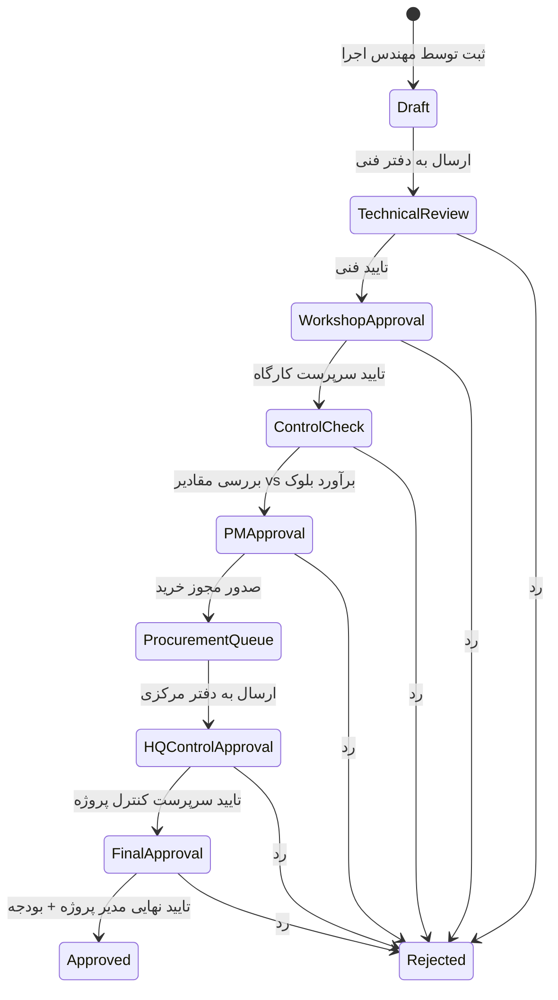
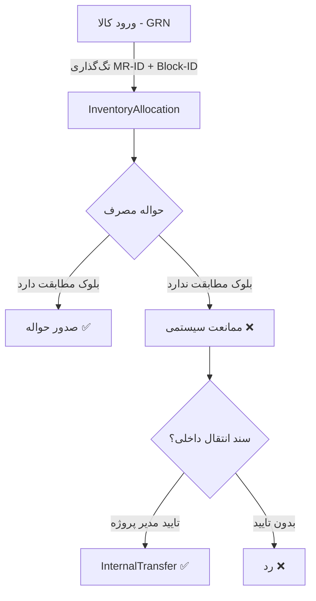
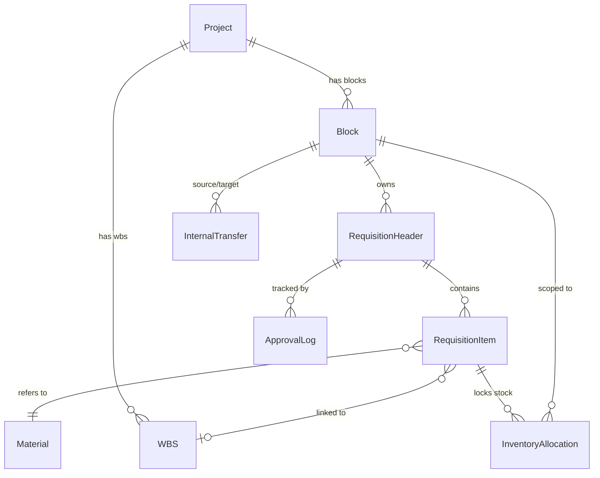

# 🏗️ نقشه پیاده‌سازی: سیستم تدارکات و لجستیک هوشمند (Block-Based Traceability)

> **منبع:** [`درخواست خرید ها.docx`](file:///home/hossein/Desktop/projects/mehdi/building-management/docs/درخواست%20خرید%20ها.docx)
> **پروژه:** building-management (Django 4.2 + DRF / React Router 7)

---

## 📊 تحلیل وضعیت موجود (Gap Analysis)

> [!IMPORTANT]
> سیستم فعلی یک مدل ساده `MaterialRequest` دارد (یک متریال در هر درخواست، یک مرحله تایید). PRD جدید به **بازنویسی اساسی** ماژول تدارکات نیاز دارد.

### آنچه هست (Existing)

| مؤلفه | وضعیت فعلی | فایل |
|-------|------------|------|
| `MaterialRequest` | تک‌آیتمی، ۵ وضعیت ساده (pending→approved→ordered→delivered→cancelled) | [resources/models.py](file:///home/hossein/Desktop/projects/mehdi/building-management/apps/api/core/resources/models.py#L118-L155) |
| `PurchaseOrder` | OneToOne با MR، بدون تفکیک ردیفی | [resources/models.py](file:///home/hossein/Desktop/projects/mehdi/building-management/apps/api/core/resources/models.py#L158-L179) |
| `procurement_service` | approve → place_order → deliver (خطی ساده) | [procurement_service.py](file:///home/hossein/Desktop/projects/mehdi/building-management/apps/api/core/resources/services/procurement_service.py) |
| `Project` / `WBS` / `Activity` | ساختار درختی موجود | [projects/models.py](file:///home/hossein/Desktop/projects/mehdi/building-management/apps/api/core/projects/models.py) |
| `Material` | شامل `block_type` ولی بدون قفل‌گذاری بلوکی | [resources/models.py](file:///home/hossein/Desktop/projects/mehdi/building-management/apps/api/core/resources/models.py#L29-L61) |
| `InventoryTransaction` | فقط `block_ref` به‌عنوان CharField | [resources/models.py](file:///home/hossein/Desktop/projects/mehdi/building-management/apps/api/core/resources/models.py#L71-L108) |

### آنچه باید ساخته شود (Gaps)

- ❌ مدل Block/Phase به‌عنوان مرکز هزینه و انبار مجازی مستقل
- ❌ درخواست خرید چندآیتمی (Header + Items)
- ❌ State Machine با ۸ مرحله تاییدی ترتیبی
- ❌ سه نوع درخواست (عادی / فورس‌ماژور / پس‌نگر)
- ❌ تفکیک ردیفی بین کارپردازان (Line-Item Splitting)
- ❌ خرید ناقص و وضعیت On-Hold
- ❌ قفل‌گذاری موجودی سطح بلوک (Reserved Stock / Hard Stop)
- ❌ سند انتقال بین‌بلوکی
- ❌ Validation Gates (بودجه WBS، رسید vs حواله)
- ❌ داشبورد و گزارشات تخصصی

---

## 🏛️ معماری پیشنهادی

### اپ جدید: `procurement`

```
apps/api/core/procurement/
├── __init__.py
├── apps.py
├── models/
│   ├── __init__.py
│   ├── block.py              # Block/Phase model
│   ├── requisition.py        # RequisitionHeader + RequisitionItem
│   ├── approval.py           # ApprovalLog + ApprovalStep config
│   ├── purchase_order.py     # PO (new, multi-item)
│   ├── inventory_allocation.py  # Block-level lock
│   └── internal_transfer.py  # Inter-block transfer
├── services/
│   ├── __init__.py
│   ├── requisition_service.py
│   ├── approval_engine.py    # State machine
│   ├── procurement_service.py
│   ├── inventory_lock_service.py
│   └── transfer_service.py
├── serializers/
│   ├── __init__.py
│   ├── requisition_serializers.py
│   ├── approval_serializers.py
│   └── po_serializers.py
├── views/
│   ├── __init__.py
│   ├── requisition_views.py
│   ├── approval_views.py
│   ├── po_views.py
│   └── report_views.py
├── urls.py
├── permissions.py
├── admin.py
├── migrations/
└── tests/
```

---

## 📋 فازهای پیاده‌سازی

### فاز ۱: مدل‌های داده‌ای (Data Layer)

> [!NOTE]
> تمام مدل‌ها از `AuditSoftDeleteModel` ارث‌بری می‌کنند تا Audit Trail داشته باشیم.

#### 1.1 مدل `Block` (بلوک / فاز)

```python
class Block(AuditSoftDeleteModel):
    """بلوک/فاز پروژه — مرکز هزینه و انبار مجازی مستقل"""
    project = FK(Project)           # Level 1
    block_code = CharField(30)      # e.g., "BLK-A"
    block_name = CharField(200)     # e.g., "بلوک A"
    wbs = FK(WBS, null=True)        # Level 3 linkage
    budget = Decimal(18,2)          # بودجه تخصیصی
    is_active = BooleanField(True)
    # unique_together: (project, block_code)
```

#### 1.2 مدل `RequisitionHeader` (سرتیتر درخواست خرید)

```python
class RequisitionType(TextChoices):
    PLANNED    = 'planned',    'عادی (Planned)'
    FAST_TRACK = 'fast_track', 'فورس‌ماژور (Fast-Track)'
    POST_FACTO = 'post_facto', 'پس‌نگر (Post-Facto)'

class RequisitionPriority(TextChoices):
    NORMAL    = 'normal',    'Normal'
    HIGH      = 'high',      'High'
    EMERGENCY = 'emergency', 'Emergency'

class RequisitionStatus(TextChoices):
    DRAFT                = 'draft',                'پیش‌نویس'
    TECHNICAL_REVIEW     = 'technical_review',     'بررسی فنی'
    WORKSHOP_APPROVAL    = 'workshop_approval',    'تایید کارگاه'
    CONTROL_CHECK        = 'control_check',        'کنترل پروژه'
    PM_APPROVAL          = 'pm_approval',          'تایید مدیر پروژه'
    PROCUREMENT_QUEUE    = 'procurement_queue',    'صف تدارکات'
    HQ_CONTROL_APPROVAL  = 'hq_control_approval',  'تایید دفتر مرکزی'
    FINAL_APPROVAL       = 'final_approval',       'تایید نهایی'
    APPROVED             = 'approved',             'تایید شده'
    REJECTED             = 'rejected',             'رد شده'

class RequisitionHeader(AuditSoftDeleteModel):
    project = FK(Project)
    block = FK(Block)                   # انبار مجازی مستقل
    requisition_number = CharField(30)  # auto-generated
    requisition_type = CharField(choices=RequisitionType)
    priority = CharField(choices=RequisitionPriority)
    urgency = CharField(max_length=50, blank=True)  # فوریت (از سند اصلی §۷.۱)
    status = CharField(choices=RequisitionStatus, default=DRAFT)
    requested_by = FK(User)             # مهندس اجرا
    request_date = DateField()
    required_by_date = DateField(null=True)
    is_grn_provisional = BooleanField(default=False)  # برای پس‌نگر: رسید انبار «موقت» تا تکمیل امضا
    notes = TextField(blank=True)
```

#### 1.3 مدل `RequisitionItem` (ردیف‌های درخواست)

```python
class ItemStatus(TextChoices):
    PENDING   = 'pending',   'در انتظار'
    APPROVED  = 'approved',  'تایید شده'
    ON_HOLD   = 'on_hold',   'در انتظار بودجه'
    ORDERED   = 'ordered',   'سفارش داده شده'
    DELIVERED = 'delivered',  'تحویل شده'
    CANCELLED = 'cancelled', 'لغو شده'

class RequisitionItem(AuditSoftDeleteModel):
    header = FK(RequisitionHeader, related_name='items')
    line_number = PositiveIntegerField()
    material = FK(Material)
    wbs_node = FK(WBS)                    # سرفصل کاری (Level 3)
    requested_qty = Decimal(18,4)         # مقدار درخواستی
    approved_qty = Decimal(18,4, null=True)  # ممکن است کمتر تایید شود
    purchased_qty = Decimal(18,4, default=0) # مقادیر خریداری شده (از سند اصلی §۷.۱)
    status = CharField(choices=ItemStatus, default=PENDING)
    assigned_to = FK(User, null=True)     # کارپرداز (Line-Item Splitting)
    notes = TextField(blank=True)
```

#### 1.4 مدل `ApprovalLog` (ردپای تاییدها)

```python
class ApprovalAction(TextChoices):
    APPROVE = 'approve', 'تایید'
    REJECT  = 'reject',  'رد'
    RETURN  = 'return',  'بازگشت'

class ApprovalLog(models.Model):
    requisition = FK(RequisitionHeader, related_name='approval_logs')
    step_from = CharField()           # مرحله مبدأ
    step_to = CharField()             # مرحله مقصد
    action = CharField(choices=ApprovalAction)
    performed_by = FK(User)
    performed_at = DateTimeField(auto_now_add=True)
    comments = TextField(blank=True)
```

#### 1.5 مدل `InventoryAllocation` (قفل‌گذاری بلوکی)

```python
class InventoryAllocation(AuditSoftDeleteModel):
    """جدول واسط برای قفل کردن موجودی به کد MR و بلوک"""
    requisition_item = FK(RequisitionItem)
    block = FK(Block)
    material = FK(Material)
    allocated_qty = Decimal(18,4)     # مقدار رزرو شده
    received_qty = Decimal(18,4, default=0)  # مقدار رسید شده (GRN)
    issued_qty = Decimal(18,4, default=0)    # مقدار حواله شده
    mr_tag = CharField()              # [MR-ID]-[Block-ID]
```

#### 1.6 مدل `InternalTransfer` (انتقال بین‌بلوکی)

```python
class InternalTransfer(AuditSoftDeleteModel):
    """انتقال بین بلوکی فقط با تایید مدیر پروژه جهت اصلاح هزینه‌های دو بلوک"""
    source_block = FK(Block, related_name='transfers_out')
    target_block = FK(Block, related_name='transfers_in')
    material = FK(Material)
    quantity = Decimal(18,4)
    reason = TextField()                  # دلیل انتقال
    approved_by = FK(User, null=True)
    approved_at = DateTimeField(null=True)
    status = CharField()  # pending / approved / rejected
    cost_adjustment_notes = TextField(blank=True)  # یادداشت اصلاح هزینه دو بلوک (از سند اصلی §۶)
```

---

### فاز ۲: موتور State Machine (Approval Engine)

> [!WARNING]
> **قانون طلایی:** هیچ کاربری نباید دسترسی Jump یا Override داشته باشد. عبور از هر مرحله مشروط به Success مرحله قبل است.

#### مراحل گردش کار (۸ مرحله)



#### پیاده‌سازی State Machine

```python
# services/approval_engine.py

WORKFLOW_TRANSITIONS = {
    'draft':              {'approve': 'technical_review'},
    'technical_review':   {'approve': 'workshop_approval',   'reject': 'rejected'},
    'workshop_approval':  {'approve': 'control_check',       'reject': 'rejected'},
    'control_check':      {'approve': 'pm_approval',         'reject': 'rejected'},
    'pm_approval':        {'approve': 'procurement_queue',   'reject': 'rejected'},
    'procurement_queue':  {'approve': 'hq_control_approval', 'reject': 'rejected'},
    'hq_control_approval':{'approve': 'final_approval',      'reject': 'rejected'},
    'final_approval':     {'approve': 'approved',            'reject': 'rejected'},
}

STEP_REQUIRED_ROLES = {
    'draft':               'block_engineer',
    'technical_review':    'technical_office',
    'workshop_approval':   'workshop_supervisor',
    'control_check':       'project_controller',
    'pm_approval':         'project_manager',
    'procurement_queue':   'procurement_officer',
    'hq_control_approval': 'hq_project_controller',
    'final_approval':      'ceo_or_pm_budget',
}
```

#### Validation Gate در مرحله `control_check`

```python
def validate_control_check(requisition: RequisitionHeader):
    """Gate 1: مقدار درخواستی + مقادیر قبلی > برآورد کل بلوک نباشد"""
    for item in requisition.items.all():
        total_requested = RequisitionItem.objects.filter(
            header__block=requisition.block,
            material=item.material,
            status__in=['pending', 'approved', 'ordered'],
        ).aggregate(total=Sum('requested_qty'))['total'] or 0

        budget_qty = item.material.estimated_total_qty or 0
        if total_requested > budget_qty:
            raise ValidationError(
                f'مجموع درخواست‌ها ({total_requested}) '
                f'بیشتر از برآورد بلوک ({budget_qty}) است'
            )
```

---

### فاز ۳: منطق تدارکات (Procurement Logic)

#### 3.1 تفکیک ردیفی (Line-Item Splitting)

- [ ] API endpoint برای assign کردن آیتم‌ها به کارپردازان مختلف
- [ ] هر `RequisitionItem.assigned_to` می‌تواند یک کارپرداز متفاوت باشد
- [ ] داشبورد کارپرداز: فقط آیتم‌های assign‌شده به خودش را می‌بیند

#### 3.2 خرید ناقص (Partial Fulfillment)

- [ ] مدیر مالی می‌تواند فقط بخشی از آیتم‌ها را تایید کند
- [ ] آیتم‌های تایید نشده → وضعیت `ON_HOLD` (نه `CANCELLED`)
- [ ] آیتم‌های `ON_HOLD` در صف باقی می‌مانند تا بودجه تخصیص یابد

#### 3.3 نوع درخواست‌های ویژه

| نوع | رفتار سیستمی |
|-----|-------------|
| **عادی (Planned)** | مقایسه `required_by_date` با Baseline زمان‌بندی |
| **فورس‌ماژور (Fast-Track)** | تگ قرمز 🔴 + نوتیفیکیشن آنی به مدیران + اولویت در صف تدارکات |
| **پس‌نگر (Post-Facto)** | ثبت خرید تلفنی انجام‌شده؛ رسید انبار تا تکمیل امضا «موقت» است |

---

### فاز ۴: قفل‌گذاری موجودی بلوکی (Block-Level Inventory Lock)

> [!CAUTION]
> این حساس‌ترین بخش سیستم است. هرگونه خطا منجر به مصرف مصالح بلوک دیگر می‌شود.

#### قوانین سخت‌گیرانه (Hard Stops)



- [ ] **GRN (رسید انبار):** به محض ورود → تگ `[MR-ID]-[Block-ID]` روی `InventoryAllocation`
- [ ] **Allocated Stock:** فقط کاربران دسترسی‌دار بلوک صادرکننده می‌بینند
- [ ] **Hard Stop:** انباردار فقط لیست MRهای تایید‌شده همان بلوک را می‌بیند
- [ ] **Gate 2:** `مقدار حواله خروج <= مقدار رسید شده برای آن MR خاص`
- [ ] **Transfer:** انتقال بین‌بلوکی فقط با `InternalTransfer` + تایید PM

---

### فاز ۵: API Endpoints

#### Requisition APIs

| Method | Endpoint | عملکرد |
|--------|----------|--------|
| `POST` | `/api/v1/projects/{pid}/requisitions/` | ایجاد درخواست (Draft) |
| `GET` | `/api/v1/projects/{pid}/requisitions/` | لیست درخواست‌ها (فیلتر بلوک/وضعیت) |
| `GET` | `/api/v1/projects/{pid}/requisitions/{id}/` | جزئیات درخواست + آیتم‌ها |
| `PATCH` | `/api/v1/projects/{pid}/requisitions/{id}/` | ویرایش (فقط در Draft) |
| `POST` | `/api/v1/projects/{pid}/requisitions/{id}/submit/` | ارسال به مرحله بعد |
| `POST` | `/api/v1/projects/{pid}/requisitions/{id}/approve/` | تایید مرحله فعلی |
| `POST` | `/api/v1/projects/{pid}/requisitions/{id}/reject/` | رد درخواست |

#### Procurement APIs

| Method | Endpoint | عملکرد |
|--------|----------|--------|
| `POST` | `/api/v1/projects/{pid}/requisitions/{id}/assign-items/` | تفکیک ردیفی به کارپردازان |
| `POST` | `/api/v1/projects/{pid}/requisitions/{id}/partial-approve/` | تایید جزئی آیتم‌ها |
| `PATCH` | `/api/v1/projects/{pid}/requisition-items/{id}/hold/` | تغییر وضعیت به On-Hold |

#### Inventory Lock APIs

| Method | Endpoint | عملکرد |
|--------|----------|--------|
| `POST` | `/api/v1/projects/{pid}/blocks/{bid}/grn/` | ثبت رسید انبار + تگ‌گذاری |
| `POST` | `/api/v1/projects/{pid}/blocks/{bid}/issue/` | صدور حواله مصرف (با Hard Stop) |
| `GET` | `/api/v1/projects/{pid}/blocks/{bid}/stock/` | موجودی رزرو‌شده بلوک |
| `POST` | `/api/v1/projects/{pid}/transfers/` | ثبت سند انتقال بین‌بلوکی |

---

### فاز ۶: گزارشات و داشبورد

| گزارش | شرح | Endpoint |
|-------|------|----------|
| **داشبورد نقدینگی** | درخواست‌های On-Hold به دلیل نبود بودجه | `GET /api/v1/projects/{pid}/reports/liquidity/` |
| **انحراف متریال** | درخواستی vs خریداری‌شده vs مصرف‌شده (به تفکیک بلوک) | `GET /api/v1/projects/{pid}/reports/material-deviation/` |
| **Audit Trail** | زمان هر امضا، تاخیرها، مسیر طی‌شده | `GET /api/v1/projects/{pid}/reports/audit-trail/` |
| **وضعیت کارپردازان** | آیتم‌های هر کارپرداز و پیشرفت خرید | `GET /api/v1/projects/{pid}/reports/procurement-status/` |

---

### فاز ۷: فرانت‌اند (React)

- [ ] صفحه ایجاد درخواست خرید (فرم چند‌آیتمی با انتخاب بلوک)
- [ ] صفحه لیست درخواست‌ها (با فیلتر بلوک/وضعیت/نوع/اولویت)
- [ ] صفحه جزئیات + تایملاین تاییدها
- [ ] داشبورد کارپرداز (آیتم‌های assign‌شده)
- [ ] صفحه انبارداری بلوکی (رسید/حواله با Hard Stop)
- [ ] داشبورد گزارشات (نقدینگی، انحراف، Audit Trail)

---

## 🔄 ارتباط با مدل‌های موجود



---

## ⚠️ نکات مهاجرت (Migration Strategy)

> [!WARNING]
> مدل فعلی `MaterialRequest` و `PurchaseOrder` در [`resources/models.py`](file:///home/hossein/Desktop/projects/mehdi/building-management/apps/api/core/resources/models.py) باید حفظ شوند (backward compatibility) تا داده‌های قدیمی از بین نروند.

1. **اپ جدید `procurement`** به‌صورت مستقل ساخته شود
2. مدل‌های قدیمی `MaterialRequest` / `PurchaseOrder` deprecated شوند (نه حذف)
3. Data migration script برای انتقال داده‌های قدیمی به ساختار جدید
4. Feature flag برای سوییچ تدریجی از سیستم قدیم به جدید

---

## 📅 تخمین زمانی

| فاز | شرح | مدت تخمینی |
|-----|------|-----------|
| فاز ۱ | مدل‌های داده‌ای + migrations | ۳-۴ روز |
| فاز ۲ | State Machine + Approval Engine | ۴-۵ روز |
| فاز ۳ | منطق تدارکات (split/partial/hold) | ۳-۴ روز |
| فاز ۴ | قفل‌گذاری موجودی بلوکی | ۴-۵ روز |
| فاز ۵ | API Endpoints + Serializers + Tests | ۵-۶ روز |
| فاز ۶ | گزارشات و داشبورد (Backend) | ۳-۴ روز |
| فاز ۷ | فرانت‌اند React | ۷-۱۰ روز |
| **مجموع** | | **۲۹-۳۸ روز کاری** |

---

## ✅ چک‌لیست پیش از شروع

- [ ] تصمیم‌گیری: آیا مدل `Block` به‌عنوان FK روی `Project` ساخته شود یا از `WBS` سطح ۱ استفاده شود؟
- [ ] تصمیم‌گیری: سیستم نوتیفیکیشن فعلی برای Fast-Track کافی است؟
- [ ] تصمیم‌گیری: نقش‌های کاربری (roles) در سیستم `permissions` فعلی تعریف شده‌اند؟
- [ ] تصمیم‌گیری: Post-Facto flow نیاز به مسیر تایید متفاوت دارد؟
- [ ] Review مدل `SpaceMaterialRequest` در inventory — آیا باید با سیستم جدید ادغام شود؟
